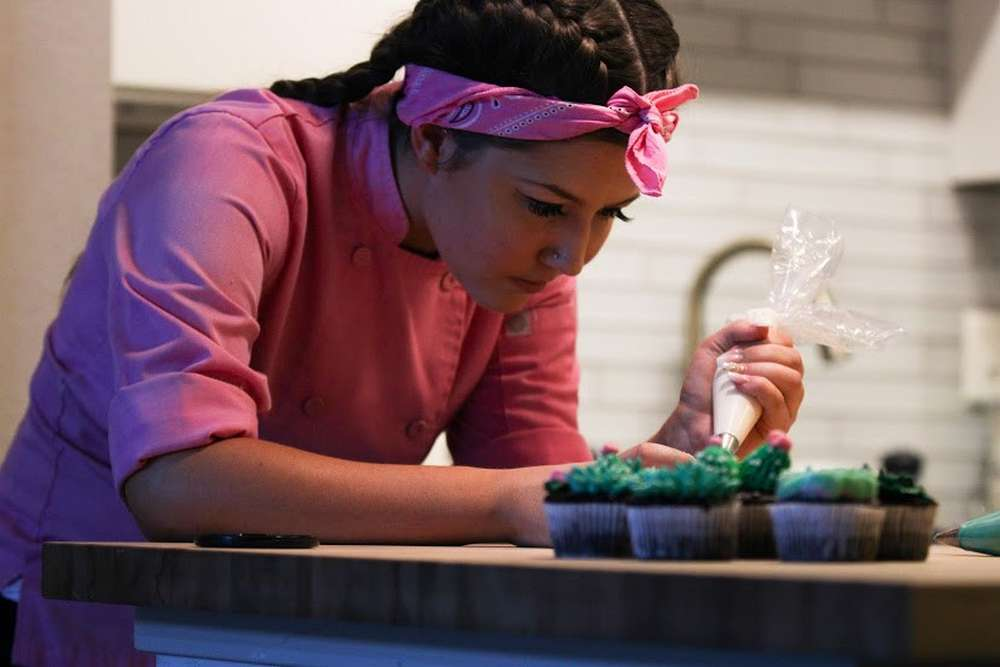

Hi everyone I am Rachel Wheeler the owner of lil pink’s pastries! I started my
journey of baking & pastry self teaching myself around the age of 14. Once I
started baking for fun, I decided that baking & pastry was my passion and what I
wanted to do for the rest of my life. After this decision, I went on to get my
degree at Johnson & Wales University & study abroad in France at École Nationale
Supérieure de Pâtisserie. After working in restaurants since the age of 16, I
made the scary yet exhilarating decision to move out of the world of working for
someone else and venture into the world of being my own boss. Since making this
decision, my business has continued to grow in ways I could not have expected. I
am so grateful for all my customers who continue to help my business grow, while
also letting me have a part in some of their biggest special occasions
